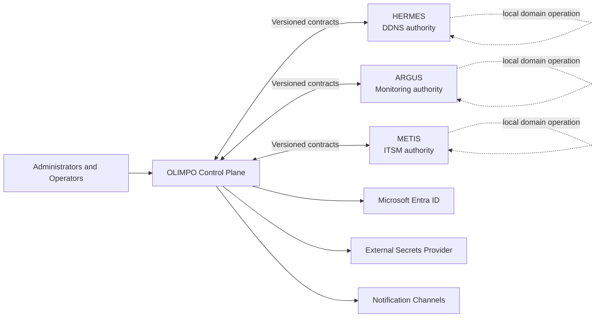
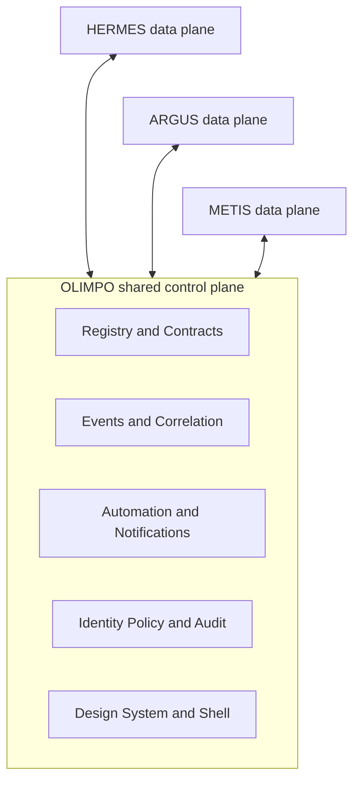
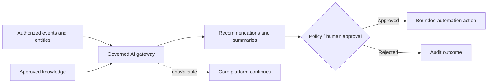

# OLIMPO Architecture and Functional Specification v1.0

Status: Initial baseline  
Repository version: 0.1.0-dev

## Executive summary

OLIMPO is the shared control plane for the MCA application suite. It gives HERMES, ARGUS, METIS, and future products a governed integration surface, consistent identity and experience, and shared operational capabilities without absorbing their domain responsibilities.

> **Products remain operationally autonomous; OLIMPO provides shared control-plane capabilities, not mandatory data-plane dependency.**

This is the dominant architectural constraint. Routine DDNS, monitoring, and ITSM operation must not require synchronous OLIMPO availability. The platform favors asynchronous, replayable integration and graceful degradation, avoiding a distributed monolith.

## Goals and non-goals

Goals are to establish a common suite experience; register applications and capabilities; correlate canonical entities; standardize APIs and events; support explainable correlation, automation, notifications, maintenance, search, audit, and health; and provide shared identity policy with local enforcement.

This phase does not implement applications, replace product domain logic, centralize all product data, act as a plaintext secret vault, require OLIMPO for product operation, deploy infrastructure, or provide autonomous AI remediation.

## Architecture principles

1. Product autonomy and explicit source-of-truth boundaries come first.
2. Contract-first, versioned APIs and events permit independent upgrades.
3. Asynchronous integration is preferred; synchronous calls are reserved for explicit user interactions and fail gracefully.
4. Delivery is treated as at least once: consumers are idempotent and tolerate duplicates, delay, and reordering.
5. Security is enforced at every service boundary, never only in the UI.
6. Correlation and automation decisions are explainable, bounded, and auditable.
7. Shared experience components are OLIMPO-owned, accessible, and theme-native.
8. Cached policy and local queues enable graceful degradation and later reconciliation.
9. Technology choices remain reversible behind internal abstractions until accepted by ADR.

## Ecosystem context

## Functional capabilities and component model

The logical model comprises an application/service registry; canonical entity directory; integration gateway and contract catalog; event abstraction and schema registry; explainable correlation; bounded automation; notification router; maintenance-window service; identity and policy administration; federated search broker; deep-link resolver; audit ledger; ecosystem health; feature/policy distribution; and shared design-system/application-shell packages.

Registry entries include application ID, name, version, base and API URLs, health endpoint, capabilities, supported event/action types, integration state, last health result, and extensible metadata. Capability discovery—not hard-coded product names—enables future applications.

Detailed boundaries are defined in the [control-plane](control-plane-v1.0.md), [integration](integration-model-v1.0.md), [entity](common-entity-model-v1.0.md), [event](event-model-v1.0.md), and [automation](automation-model-v1.0.md) specifications.

## Data ownership

| Domain | Authoritative owner | OLIMPO-held data |
|---|---|---|
| DDNS domains, clients, updates | HERMES | References, health summaries, integration events |
| Monitoring observations and evaluation | ARGUS | References, summaries, correlated conditions |
| Tickets, incidents, SLA lifecycle | METIS | References, workflow outcomes, cached summaries |
| Cross-product identity | OLIMPO | Canonical IDs and product reference mappings |
| Integration and automation control | OLIMPO | Definitions, execution state, idempotency, audit |

Caching never silently changes authority. Cached values carry source and freshness metadata; reconciliation follows the source product after partitions.

## Identity and security

Microsoft Entra ID is the primary enterprise identity provider through OIDC/OAuth 2.0, providing SSO and MFA policy. OLIMPO maps shared roles to product-specific permissions, while products enforce authorization locally. A tightly controlled local bootstrap administrator and audited emergency access remain available. Service identities use scoped, short-lived credentials and rotation; legacy API keys are isolated compatibility mechanisms with migration plans. Secret values remain in an external provider. See [Identity and security](identity-security-v1.0.md).

Security requires least privilege, zero trust where practical, encryption in transit and at rest where applicable, input validation, rate limiting, secure cookies, CSRF and XSS defenses, Content Security Policy, dependency hygiene, supply-chain review, and immutable-oriented auditing.

## Events, correlation, and automation

Events use a versioned common envelope with globally unique IDs, UTC timestamps, source, type, severity, correlation/causation IDs, entity references, and an evolvable payload. Consumers handle at-least-once delivery, duplicates, reordering, retry, and dead-letter recovery.

Correlation combines entity and time context—for example, gateway, switch, access-point, and camera outages at one site—into an explainable operational condition. Cross-product evidence such as a HERMES DDNS failure plus ARGUS gateway and VPN failures can strengthen a connectivity hypothesis. Rules, inputs, confidence, suppression, and decisions remain auditable.

Automations model trigger, conditions, optional delay, action, retry, timeout, failure path, escalation, notification, correlation context, audit, and optional approval. Causation lineage, execution depth, deduplication, rate limits, and explicit re-entry policies prevent loops. See [Events](event-model-v1.0.md) and [Automation](automation-model-v1.0.md).

## UI/UX

OLIMPO defines an owned design system for a clean, modern enterprise suite, inspired by the usability and clarity of modern network-management interfaces without copying proprietary CSS, assets, or pixel layouts. Shared shell, typography, navigation, tables, forms, cards, KPIs, alerts, notifications, dialogs, charts, and states are consistent. Product accents may differ—HERMES blue/cyan, ARGUS azure/blue, METIS indigo/violet-blue—but semantic status meaning never changes.

Native Light, Dark, and System themes are required, with a persistent quick selector in the upper-right. Dark Mode is intentionally designed. WCAG 2.2 AA is the target; status never relies on color alone. Primary dashboard validation targets 1920x1080, with a reusable ARGUS-focused kiosk layout. See the [design system](../design/design-system-v1.0.md).

## Reliability and deployment concept

Logical components may later be deployed independently, but deployment topology must not leak into product contracts. Products retain local queues, cached safe policy, local authorization decisions where possible, and essential notifications. Adapters isolate failures with timeouts, exponential backoff plus jitter, circuit breakers, idempotency stores, replay, and dead-letter handling. See [Autonomy and resilience](autonomy-resilience-v1.0.md).

Candidate technologies—not irreversible selections—are React/TypeScript and `@mca/olimpo` packages, Python 3/FastAPI, PostgreSQL, and NATS JetStream behind an OLIMPO event abstraction. Redis is used only for a justified coordination or cache need. Production selections require ADRs and operational evaluation.

## Observability and audit

Components emit structured logs, metrics, traces, health/readiness signals, and consistent request, correlation, and event identifiers with OpenTelemetry compatibility. Sensitive values are redacted. Operational telemetry is mutable/retention-oriented; security and administrative audit is immutable-oriented, access-controlled, and records actor, action, time, location/context, source, target, outcome, IDs, and appropriate before/after metadata. See [Observability and audit](observability-audit-v1.0.md).

## APIs, versioning, and upgrades

APIs are OpenAPI-first, machine-readable, and explicitly versioned. Events have versioned envelopes and payload schemas. Additive evolution is preferred; breaking changes require a new version, documented migration, measured deprecation window, and compatibility matrix. Producers and consumers upgrade independently through overlap periods, consumer-driven compatibility tests, and rollback/replay plans.

## Testing strategy

Future implementation must include unit and component tests; API and event contract tests; integration tests with fakes; resilience and partition tests; security and dependency tests; WCAG accessibility and visual-regression tests; and end-to-end tests. The `ARGUS alert -> OLIMPO correlation -> METIS incident` path must run without production systems and verify duplicates, delay, ordering, partial failure, recovery, authorization, and audit.

## Future extensibility

Capability-based registration supports new products. A future AI assistance boundary may consume authorized event, entity, and historical incident views to suggest correlations, classifications, summaries, or likely resolution steps. AI is never required for core operation; outputs carry evidence and model provenance, are permission- and policy-controlled, auditable, explainable where possible, and require human approval for consequential actions.

## Risks

Principal risks are accidental synchronous coupling, conflicting identity ownership, event storms and automation loops, stale caches, overbroad roles, secret leakage, schema fragmentation, false correlation, audit growth, and UI drift. Contract governance, isolation, quotas, explicit ownership, provenance, compatibility tests, and shared packages mitigate them.

## Open questions

Human decisions are required before implementation on: deployment and tenancy model; supported product-version/deprecation window; canonical organization/site governance and conflict resolution; approved secrets provider; event-backbone selection and retention objectives; audit retention and legal requirements; notification provider ownership; recovery objectives by capability; initial Entra tenant/application topology; and whether AI assistance is in the first implementation roadmap. These questions do not block this documentation baseline.
