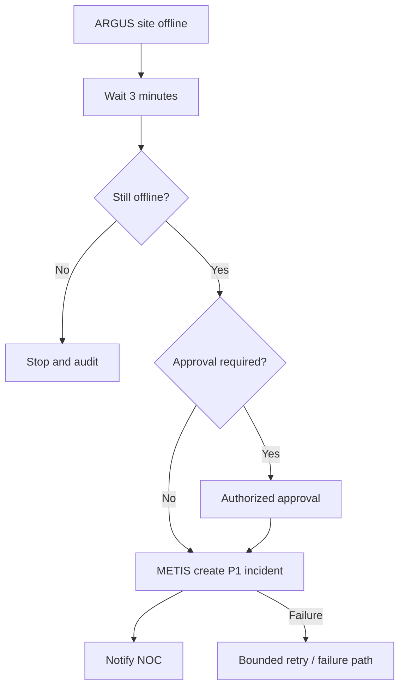
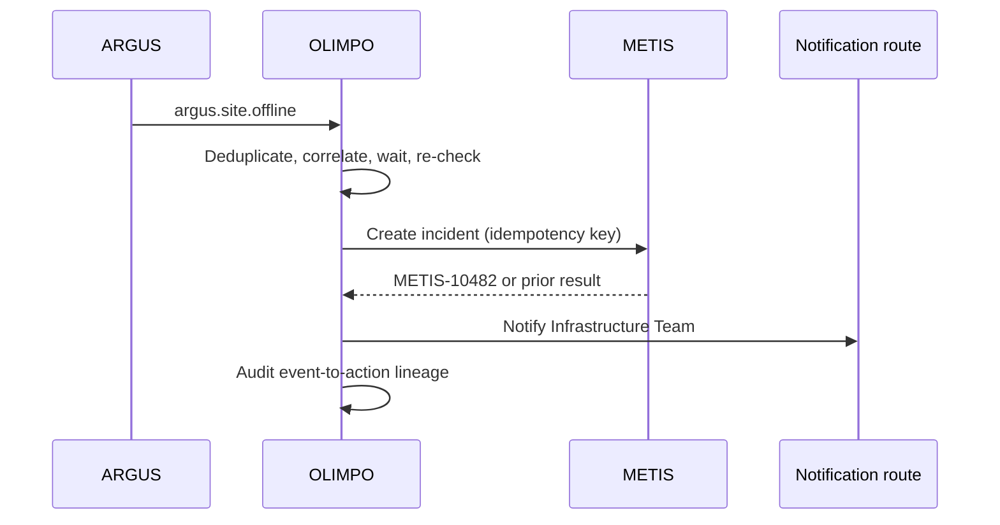

# Automation Model v1.0

## Definition

An automation definition is versioned and contains owner, scope, enabled state, trigger, conditions, optional delay, actions, timeout, retry policy, failure path, escalation, notification, correlation context, approval policy, concurrency/rate limits, and audit metadata. Publishing a version requires schema, authorization, target-capability, loop, and safety validation.

## Processing

1. Validate and deduplicate the trigger.
2. Resolve authorized canonical entity and correlation context.
3. Evaluate conditions against a recorded input snapshot.
4. Schedule delay durably, then re-evaluate time-sensitive conditions.
5. Obtain approval for policy-classified actions.
6. Invoke a registered action with an idempotency key and deadline.
7. Record result, retry or failure path, notifications, and audit evidence.

Executions have immutable IDs and a state machine such as received, evaluating, waiting, approval-pending, running, succeeded, failed, cancelled, or expired. Retries never create a new logical execution or duplicate a successful external effect.

## Incident workflow

## Loop and failure controls

Causation IDs form a lineage graph. The engine enforces maximum depth, repeated event/action pair detection, per-rule cooldown, rate and concurrency limits, and explicit rules for whether an automation-produced event can re-enter its origin. Cycles detected at definition time block publication; runtime cycles quarantine the execution and alert an operator.

Actions use least-privilege service identities. Partial success is represented explicitly; compensation is a separate authorized action, not an implicit distributed transaction. Exhausted failures enter an operator-visible queue with safe replay. Maintenance suppression is evaluated but never discards the trigger; the reason and decision are audited.

AI may later recommend rules or steps but cannot silently publish definitions or execute consequential remediation. Policy may require human approval, and core processing remains deterministic without AI.
