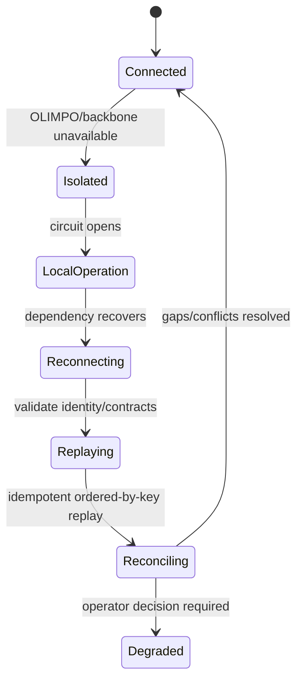

# Autonomy and Resilience Model v1.0

> **Products remain operationally autonomous; OLIMPO provides shared control-plane capabilities, not mandatory data-plane dependency.**

## Required patterns

Products persist essential domain work locally and use transactional outbox/local queue patterns where appropriate. Integrations use bounded exponential backoff with jitter, circuit breakers, timeouts, bulkheads, idempotency, event replay, eventual consistency, dead-letter handling, cached last-known-good policy, and explicit reconciliation. Queues have capacity, retention, priority, backpressure, and operator-visible overflow policy; important events are never silently discarded.

## Failure behavior

| Failure | Required behavior |
|---|---|
| OLIMPO unavailable | HERMES continues DDNS, ARGUS continues monitoring, METIS continues ITSM. Products queue integration facts, use bounded cached policy, retain essential local notifications, and expose degraded cross-product UX. |
| HERMES unavailable | OLIMPO marks HERMES data stale/unavailable, stops unsafe actions, retains events/work, and does not impair ARGUS or METIS. HERMES reconciles authoritative DDNS state on return. |
| ARGUS unavailable | Last observations are visibly stale; no new monitoring truth is inferred. HERMES, METIS, and OLIMPO continue. Replayed observations preserve original times and avoid duplicate incidents. |
| METIS unavailable | Incident actions queue or enter a visible retry/failure path according to expiry; idempotency prevents duplicate tickets. ARGUS monitoring and HERMES DDNS continue. |
| Event backbone unavailable | Local outboxes buffer within policy; synchronous domain work does not wait indefinitely. Backpressure/overflow alerts locally. On recovery, publishers replay and consumers deduplicate. |
| Identity provider unavailable | Locally valid sessions may continue within policy; new federation and privilege elevation may fail. Bootstrap/emergency access remains controlled. Domain services continue under cached local authorization where safe. |
| Product reconnects after isolation | Reauthenticate, negotiate compatible contract, exchange checkpoints, replay retained events, identify gaps, deduplicate, reconcile authoritative state, refresh mappings/policy, and surface conflicts for review. |

## Consistency and recovery

Cross-product views are eventually consistent and show freshness. The authoritative product wins domain-state conflicts; OLIMPO wins canonical mapping and control-plane definition conflicts, subject to audited human resolution. Event time and receipt time are retained. Reconciliation is resumable, rate-limited, and cannot monopolize live traffic.

Recovery after OLIMPO outage reopens circuits gradually, validates cached-policy successors, drains queues with backpressure, rebuilds projections, resumes timers without duplicating actions, re-evaluates expired approvals/maintenance, and compares audit checkpoints. Recovery after product outage follows the same principles while respecting that product's authority.

## Resilience validation

Future tests inject process failures, latency, packet loss, partitions, full queues, duplicate/out-of-order events, clock skew, stale policy, identity loss, schema incompatibility, and extended isolation. Tests prove essential product operation, bounded resource use, visible degradation, safe replay, idempotent side effects, and complete audit lineage. Capability-specific RTO, RPO, queue retention, cache TTL, and offline-duration limits require human approval before production design.
