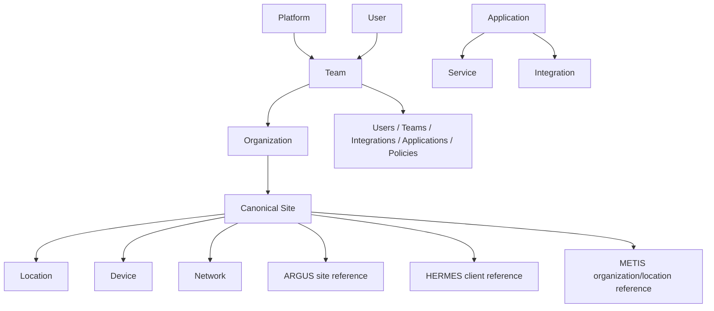

# Common Entity Model v1.0

> **Tenant isolation is a security boundary. Tenant data, identity, credentials, events, integrations, automation, operational state, and audit context must not cross tenant boundaries without explicit authorized platform-level behavior.**

> **The OLIMPO ecosystem must support managed-service-provider operation without making any individual customer the architectural owner of the platform.**

## Purpose

The model correlates equivalent objects without taking over product data. Equivalent native references can map to one tenant-scoped canonical Site while each product retains its native identifier and lifecycle.

## Core types

Platform is the operator-owned OLIMPO context. Tenant is the customer security, policy, and operational isolation boundary. Organization is a business or administrative unit inside a tenant; a tenant may contain one or more organizations. Site is a cross-product operational grouping within an organization, and Location is a physical or logical subdivision. Application identifies an ecosystem product; Service identifies a provided capability. User and Team identify actors and groups whose grants vary by tenant. Device and Network represent addressable infrastructure identities, not live telemetry. Integration represents a configured contract with explicit platform or tenant ownership.

Each canonical record has an immutable canonical ID, type, display name, lifecycle state, owning authority, optional parent, aliases, classification, creation/update metadata, and version. Product references contain application ID, native type and ID, display label, source URL/deep-link key, synchronization status, last-confirmed time, and non-secret metadata.

## Scope rules

`tenant_id` is mandatory for every customer-context canonical entity, product reference, and mapping. `organization_id` is mandatory when an entity belongs to a specific organization; `site_id` and `location_id` are mandatory only for objects whose ownership or authorization is narrowed to those levels. Platform-global application definitions and operator policy do not receive a fictional tenant ID. Tenant-enabled application instances and tenant integrations do.

A product-native ID is not globally unique merely because its source calls it unique. Mapping identity is at least the tuple of tenant, source application, native type, and native ID. Uniqueness, indexes, lookup keys, merge/split review, search, and deep links preserve that scope.

## Ownership and synchronization

OLIMPO is authoritative for canonical IDs, mappings, merge/split decisions, and mapping history. Source products remain authoritative for their native objects and domain attributes. Synchronization is explicit and field-level: source provenance, freshness, confidence, and conflict state accompany imported facts. Deletion in a source tombstones a reference; it does not silently delete the canonical entity.

Automatic matching may propose mappings from stable identifiers or governed rules, but ambiguous merges require authorized review. Merge and split operations retain redirects and audit history. A canonical ID is never reassigned. Products may operate with cached mappings and submit changes after reconnection.

## Authorization and privacy

Entity visibility follows tenant, narrower organization/site scope, and product authorization enforced server-side. Federated consumers receive only permitted fields. Personally identifiable data is minimized, classified, retained intentionally, and excluded from general event payloads unless required. Cross-tenant correlation and mapping are prohibited by default; explicitly authorized platform aggregation must not expose customer detail across tenants.

HERMES should eventually tenant-scope relevant agents, clients, domains, records, credentials, and operational events. ARGUS should tenant-scope sites, consoles, devices, VPNs, observations, alerts, and integrations. METIS should tenant/customer-scope tickets, incidents, requests, users/requesters, queues, technicians, SLA, service catalog, assets, and integrations. These compatibility requirements do not change their domain authority and do not claim current adoption.

## Compatibility

Entity schemas are versioned and extended additively where practical. Unknown fields are tolerated. Reference type registries enable future applications without product-specific columns. Contract tests validate mapping, tombstone, merge, split, and replay behavior.
