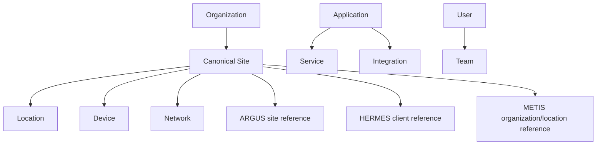

# Common Entity Model v1.0

## Purpose

The model correlates equivalent objects without taking over product data. `MIA-04`, `Miami Store 04`, and `mia-store-04` can map to one canonical Site while each product retains its native identifier and lifecycle.

## Core types

Organization is a business or tenant boundary. Site is the cross-product operational place. Location is a physical or logical subdivision. Application identifies a suite product; Service identifies a provided capability. User and Team identify actors and groups. Device and Network represent addressable infrastructure identities, not their live telemetry. Integration represents a configured contract between capabilities.

Each canonical record has an immutable canonical ID, type, display name, lifecycle state, owning authority, optional parent, aliases, classification, creation/update metadata, and version. Product references contain application ID, native type and ID, display label, source URL/deep-link key, synchronization status, last-confirmed time, and non-secret metadata.

## Ownership and synchronization

OLIMPO is authoritative for canonical IDs, mappings, merge/split decisions, and mapping history. Source products remain authoritative for their native objects and domain attributes. Synchronization is explicit and field-level: source provenance, freshness, confidence, and conflict state accompany imported facts. Deletion in a source tombstones a reference; it does not silently delete the canonical entity.

Automatic matching may propose mappings from stable identifiers or governed rules, but ambiguous merges require authorized review. Merge and split operations retain redirects and audit history. A canonical ID is never reassigned. Products may operate with cached mappings and submit changes after reconnection.

## Authorization and privacy

Entity visibility follows organization/tenant and product authorization. Federated consumers receive only permitted fields. Personally identifiable data is minimized, classified, retained intentionally, and excluded from general event payloads unless required. Cross-tenant correlation is prohibited by default.

## Compatibility

Entity schemas are versioned and extended additively where practical. Unknown fields are tolerated. Reference type registries enable future applications without product-specific columns. Contract tests validate mapping, tombstone, merge, split, and replay behavior.
