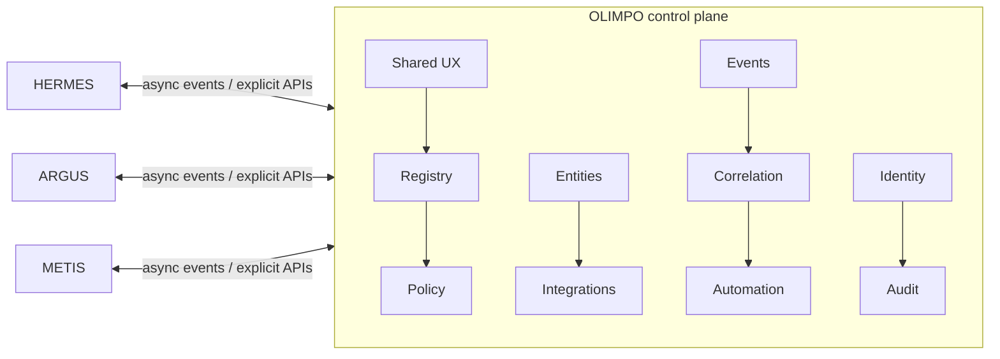
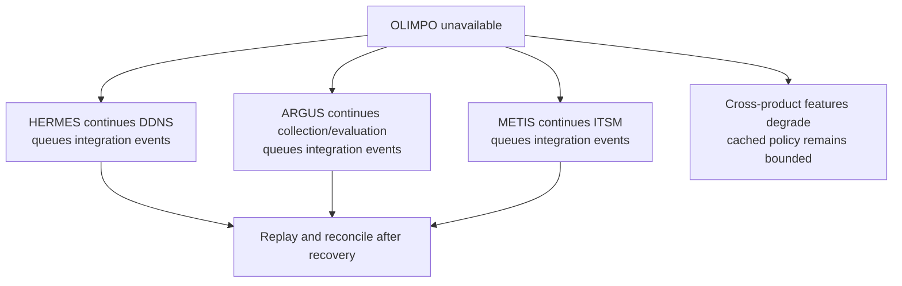

# OLIMPO Control-Plane Model v1.0

> **Products remain operationally autonomous; OLIMPO provides shared control-plane capabilities, not mandatory data-plane dependency.**

> **Tenant isolation is a security boundary. Tenant data, identity, credentials, events, integrations, automation, operational state, and audit context must not cross tenant boundaries without explicit authorized platform-level behavior.**

## Boundary

OLIMPO is the MSP-first, multi-tenant control plane for the independently owned OLIMPO ecosystem. Platform-global resources and tenant-owned resources are distinct; no customer is the platform's architectural owner.

OLIMPO coordinates suite-wide configuration, identity policy, entity correlation, integrations, automation, navigation, experience, audit, and ecosystem visibility. It does not perform HERMES DDNS work, ARGUS monitoring evaluation, or METIS ticket lifecycle work. A product must not require a synchronous OLIMPO request for routine domain operation.

## Shared capabilities

- Application/service registry and capability discovery.
- Canonical entity mapping with product-owned references.
- Contract catalog, deep links, federated search, and suite switcher.
- Event normalization, correlation, automation, notifications, and maintenance context.
- Tenant-configurable OIDC identity policy, including Microsoft Entra ID, role/capability mapping, service identity metadata, and audit.
- Feature flags and shared defaults for timezone, sessions, theme, retention, notifications, telemetry, and integration availability.
- Platform-health summaries for applications, integrations, event flow, automation, notification delivery, identity connectivity, and significant events.
- Shared design tokens, component standards, shell, themes, accessibility, and kiosk patterns.

Feature and policy values are versioned, scoped, signed or integrity-checked where justified, and cacheable with expiry and safe defaults. Products define behavior when policy is unavailable; a temporary control-plane outage must not immediately break operation.

Platform defaults and tenant overrides are distinct. Tenant feature flags, maintenance windows, health projections, search, deep links, integrations, and notifications are isolated. Platform operators receive cross-tenant views only through explicit capability policy and audit.

## Interaction rules

Every tenant-owned operation receives trusted tenant context and reauthorizes the actor and target server-side. Tenant-aware repositories, query predicates, cache namespaces, job payloads, and contract tests prevent leakage; UI context is not enforcement.

Asynchronous integration is preferred for facts and reactions. Synchronous calls are acceptable for an explicit user-driven request such as opening a cross-product detail or requesting an immediate action, provided deadlines, authorization, error states, and retry semantics are visible. OLIMPO adapters—not product domain code—encapsulate transport-specific behavior.

## Autonomy during outage

## Anti-distributed-monolith rule

Reviews must reject designs that spread a single transaction across product databases, require lockstep deployment, import another product's internal model, or make OLIMPO a mandatory synchronous hop. Contracts expose capabilities, not internal storage. Saga-like workflows acknowledge partial success and use compensation rather than distributed transactions.

## Future technology direction

React/TypeScript shared packages, FastAPI/Python, PostgreSQL, and NATS JetStream are preferred evaluation candidates. Event code depends on an internal publish/consume abstraction. Redis requires a documented need. Final choices, topology, tenancy, and operational objectives require subsequent ADRs.
