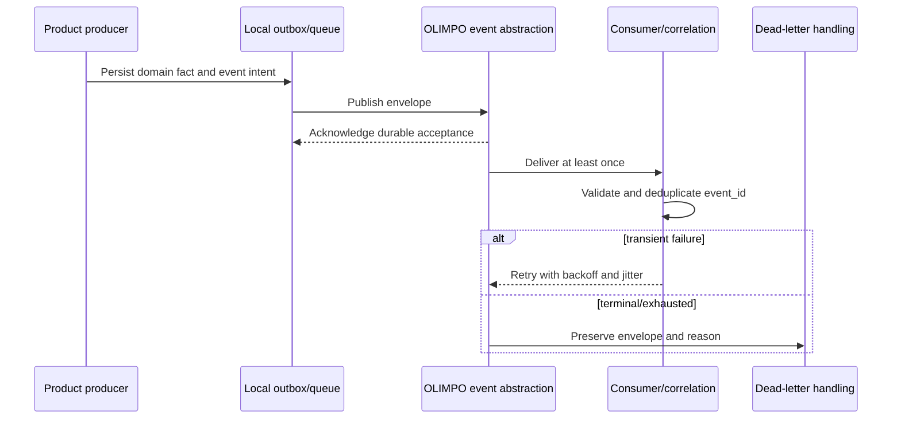
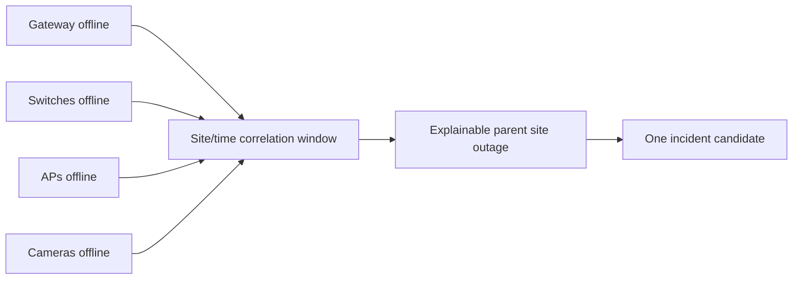

# Common Event and Correlation Model v1.0

## Envelope

Events are immutable facts expressed through a transport-independent OLIMPO abstraction. A conceptual envelope is:

```json
{
  "schema_version": "1.0",
  "event_id": "01HYPOTHETICALULID00000000",
  "source": "ARGUS",
  "type": "argus.site.offline",
  "timestamp": "2026-08-17T14:30:00Z",
  "severity": "critical",
  "correlation_id": "CORR-HYPOTHETICAL-001",
  "causation_id": "EVENT-HYPOTHETICAL-PARENT",
  "entity_refs": [{"type": "site", "canonical_id": "SITE-HYPOTHETICAL-MIA-04"}],
  "payload": {}
}
```

Required fields are schema version, globally unique event ID, registered source, namespaced type, UTC timestamp, severity, correlation ID, entity references, and payload. Causation ID is required for derived events/actions and null only for a root fact. Severity values are `critical`, `warning`, `informational`, and `unknown`; presentation may map `healthy` as state rather than incident severity.

Initial event namespaces may include `argus.site.offline`, `argus.device.offline`, `argus.vpn.down`, `hermes.client.offline`, `hermes.dns.update.failed`, `hermes.public_ip.changed`, `metis.ticket.created`, `metis.ticket.assigned`, `metis.incident.resolved`, and `metis.sla.breached`.

## Flow and delivery



At-least-once delivery means duplicates are normal. Consumers persist an idempotency result keyed by event ID and action scope. Ordering is guaranteed only where a future transport contract explicitly provides a partition/order key; consumers use timestamps, domain versions, and monotonic source sequences when supplied, and must not assume global ordering.

Retries use bounded exponential backoff with jitter and explicit maximum age/attempt policy. Poison or expired events enter a dead-letter facility with reason, attempts, schema information, and replay authorization. Replay preserves the original event ID and adds replay metadata outside the immutable business payload. Operators can inspect, repair mapping/schema issues, and replay safely.

## Schema evolution and consumer duties

Envelope and payload versions are separate. Compatible evolution adds optional fields and enum values defensively. Breaking changes use a new major schema/type version and overlap through a published deprecation window. Producers validate before publish; consumers validate, ignore unknown optional fields, reject unsupported major versions visibly, protect sensitive data, deduplicate, authorize effects, and record outcomes.

## Explainable correlation

Correlation evaluates canonical entity, topology, time window, severity, maintenance state, and prior conditions. It may combine gateway, switch, access-point, and camera failures at one site into one parent outage, or combine HERMES DDNS failure with ARGUS gateway-unreachable and VPN-down evidence into a possible connectivity outage.

Each correlation output records rule/version, contributing event IDs, entity mappings, window, maintenance context, confidence or deterministic reason, suppressed candidates, and operator overrides. Correlation never destroys source events. False-positive review and rule rollback are supported.


