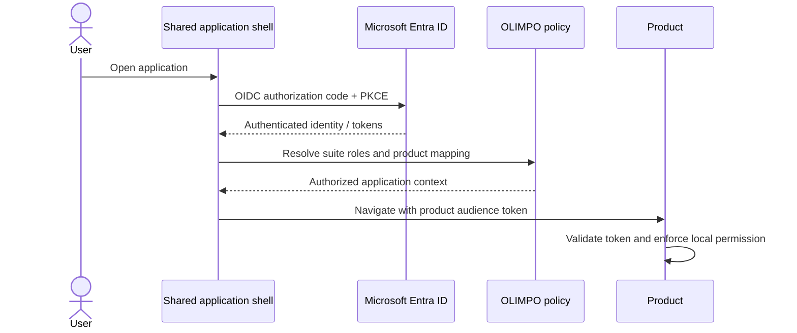
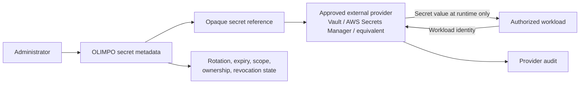

# Identity and Security Model v1.0

## Human identity and authorization

Microsoft Entra ID is the primary enterprise provider through OpenID Connect and OAuth 2.0. MFA and conditional access are enforced by the identity provider. OLIMPO provides a shared SSO experience, canonical user/team references, session policy, and role-to-product mapping; each product validates tokens and enforces its own permissions locally.

Conceptual suite roles are Platform Administrator, Network Administrator, Service Desk Manager, Technician, Auditor, Read Only, and Kiosk. They are policy bundles, not an assumption that products share identical permissions. Mapping is explicit, least-privilege, scoped by organization/site where appropriate, and auditable. Frontend visibility is usability only; every backend operation independently authorizes.

A local bootstrap administrator supports initial setup, and separately controlled emergency/recovery access supports identity outages. Both have strong authentication, restricted network/use conditions, rotation, alerts, periodic tests, and complete audit. Normal local accounts are not a substitute for federation.

If Entra connectivity fails, existing locally valid sessions may continue only within configured lifetime and risk policy; products preserve permitted local operation using cached authorization context. New enterprise authentication may be unavailable. Privilege elevation and stale high-risk permissions fail closed. Recovery reconciles revocations before extending sessions.

## Service identity and API credentials

Service-to-service access prefers OAuth 2.0 client credentials or workload identity with short-lived, audience-bound, scoped tokens. Identities have an owner, purpose, allowed actions/entities, expiry, rotation, revocation, and audit history. Mutual TLS may add workload authentication where justified.

Permanent shared static keys are avoided. A legacy API key is a named compatibility credential with minimum scope, external storage, rotation schedule, usage telemetry, owner, expiry target, and migration plan to short-lived identity.

## Secrets-reference model

OLIMPO's standard database never stores plaintext secret values. It stores opaque references and non-secret metadata: provider, credential kind, scope, owner, rotation/expiration, health, and revocation state. Secret values are retrieved directly by an authorized workload when possible, never returned to a browser, logged, traced, committed, or included in events. Provider choice requires approval and an ADR.

## Application security principles

- Least privilege, separation of duties, secure defaults, and zero trust between services where practical.
- TLS for data in transit and appropriate encryption/key governance at rest.
- Short-lived credentials, automated rotation, immediate revocation, and denied-by-default scopes.
- Server-side RBAC and object-level authorization with tenant isolation.
- Validated and size-limited inputs, parameterized data access, output encoding, safe serialization, and rate/abuse limiting.
- CSRF protection for cookie-authenticated writes; secure, HttpOnly, SameSite cookies; XSS prevention and a restrictive Content Security Policy.
- Dependency pinning/update policy, provenance, SBOM and vulnerability scanning, reviewed build actions, and supply-chain incident response.
- Sensitive-data classification, minimization, redaction, retention, and secure disposal.
- Security events and administrative actions enter immutable-oriented audit; operational logs contain no credentials.

Threat modeling, security tests, dependency review, static/dynamic analysis, penetration testing proportional to risk, and incident-response exercises are release requirements for future implementation.
