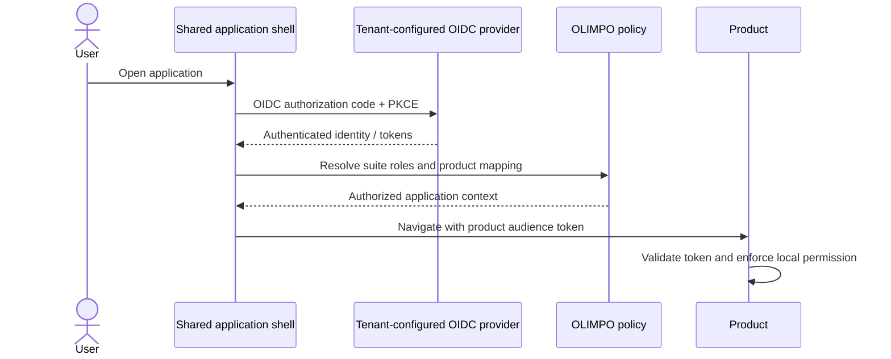
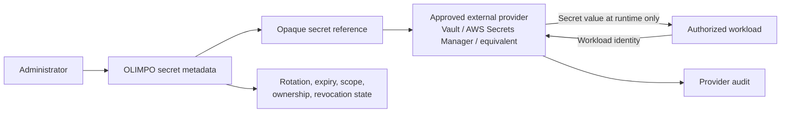

# Identity and Security Model v1.0

> **The OLIMPO ecosystem must support managed-service-provider operation without making any individual customer the architectural owner of the platform.**

## Human identity and authorization

OLIMPO permits per-tenant OpenID Connect and OAuth 2.0 configuration. Microsoft Entra ID remains a preferred enterprise provider, but no Entra tenant, application, domain, or claim mapping is globally tied to one company. Other OIDC providers and controlled local identity may be supported. Provider metadata, discovery rules, callback binding, issuer and audience validation, claim mapping, SSO, and provider-enforced MFA are tenant-aware; each product validates tokens and enforces permissions locally.

Authorization has two explicit planes. Conceptual platform/MSP roles include Platform Owner, Platform Administrator, MSP Operator, and MSP Auditor. They may access multiple tenants only through explicit capability policy and every use is strongly audited. Conceptual tenant roles include Tenant Administrator, Network Administrator, Service Desk Manager, Technician, Auditor, Read Only, and Kiosk. Role names are mutable policy bundles, not the authorization primitive. Capability grants and mappings are explicit, least-privilege, tenant-scoped and, where appropriate, organization/site-scoped and auditable. A user can be Network Administrator in Tenant A, Read Only in Tenant B, and have no access to Tenant C. Frontend visibility is usability only; every backend operation independently authorizes.

A local bootstrap administrator supports initial setup, and separately controlled emergency/recovery access supports identity outages. Both have strong authentication, restricted network/use conditions, rotation, alerts, periodic tests, and complete audit. Normal local accounts are not a substitute for federation.

If Entra connectivity fails, existing locally valid sessions may continue only within configured lifetime and risk policy; products preserve permitted local operation using cached authorization context. New enterprise authentication may be unavailable. Privilege elevation and stale high-risk permissions fail closed. Recovery reconciles revocations before extending sessions.

## Service identity and API credentials

Service-to-service access prefers OAuth 2.0 client credentials or workload identity with short-lived, audience-bound, scoped tokens. Identities have an owner, purpose, allowed actions/entities, expiry, rotation, revocation, and audit history. Mutual TLS may add workload authentication where justified.

Permanent shared static keys are avoided. A legacy API key is a named compatibility credential with minimum scope, external storage, rotation schedule, usage telemetry, owner, expiry target, and migration plan to short-lived identity.

Service identities and credentials have explicit platform or tenant ownership. Tenant-owned credentials cannot authenticate against or retrieve another tenant's resource, even when native identifiers collide.

## Tenant isolation requirements

> **Tenant isolation is a security boundary. Tenant data, identity, credentials, events, integrations, automation, operational state, and audit context must not cross tenant boundaries without explicit authorized platform-level behavior.**

No tenant data leakage is a first-class security requirement. Trusted tenant context is mandatory in service operations and derived from authenticated identity plus validated route, resource, or integration binding. APIs perform server-side capability and object authorization. Data-access layers require tenant-aware repositories and predicates; search and caches use tenant namespaces; background jobs revalidate scope; events and audit preserve tenant ID; and future files or attachments inherit tenant ownership.

Defense in depth includes denial by default, least privilege, scoped workload identities, invariant checks between actor/resource/target, cross-tenant leakage contract and integration tests, and security telemetry. PostgreSQL Row-Level Security may be evaluated in a later ADR but is not selected here.

## Secrets-reference model

OLIMPO's standard database never stores plaintext secret values. It stores opaque references and non-secret metadata: provider, credential kind, scope, owner, rotation/expiration, health, and revocation state. Secret values are retrieved directly by an authorized workload when possible, never returned to a browser, logged, traced, committed, or included in events. Provider choice requires approval and an ADR.

## Application security principles

- Least privilege, separation of duties, secure defaults, and zero trust between services where practical.
- TLS for data in transit and appropriate encryption/key governance at rest.
- Short-lived credentials, automated rotation, immediate revocation, and denied-by-default scopes.
- Server-side RBAC and object-level authorization with tenant isolation.
- Validated and size-limited inputs, parameterized data access, output encoding, safe serialization, and rate/abuse limiting.
- CSRF protection for cookie-authenticated writes; secure, HttpOnly, SameSite cookies; XSS prevention and a restrictive Content Security Policy.
- Dependency pinning/update policy, provenance, SBOM and vulnerability scanning, reviewed build actions, and supply-chain incident response.
- Sensitive-data classification, minimization, redaction, retention, and secure disposal.
- Security events and administrative actions enter immutable-oriented audit; operational logs contain no credentials.

Threat modeling, security tests, dependency review, static/dynamic analysis, penetration testing proportional to risk, and incident-response exercises are release requirements for future implementation.
