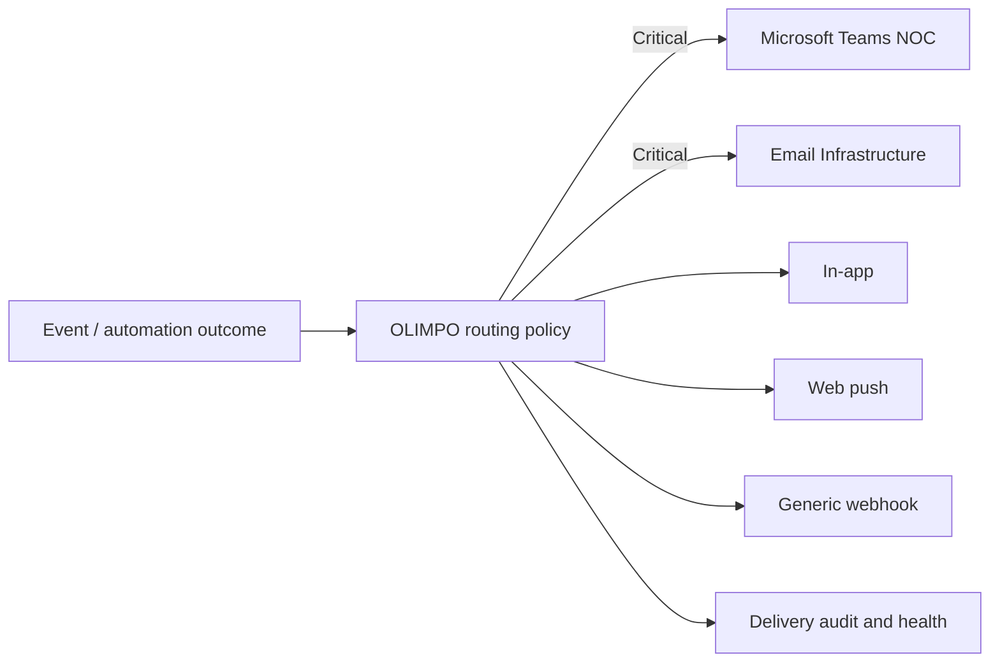

# Integration Model v1.0

> **Tenant isolation is a security boundary. Tenant data, identity, credentials, events, integrations, automation, operational state, and audit context must not cross tenant boundaries without explicit authorized platform-level behavior.**

> **The OLIMPO ecosystem must support managed-service-provider operation without making any individual customer the architectural owner of the platform.**

## Registry and contracts

Each application and service registers a stable ID, name, version, user base URL, API and health endpoints, capabilities, supported event types and actions, integration state, latest health result/time, contract versions, and extensible non-secret metadata. Future products integrate by capability and contract; OLIMPO code must not assume only HERMES, ARGUS, and METIS.

Registry definitions distinguish a platform-global application or service from a tenant-enabled instance. Tenant-owned integrations include `tenant_id`, owner, allowed capabilities, target scope, secret references, callback metadata, and health without secret values. Platform-owned integrations are a separate class and cannot be mistaken for tenant resources.

APIs are OpenAPI-first, versioned, authenticated, authorized, deadline-bound, and machine-readable. Adapters translate product-native contracts to OLIMPO contracts and isolate rate limits, circuit breakers, retries, and compatibility. A compatibility matrix records OLIMPO, product, API, and event versions. Additive evolution is preferred; breaking changes have a new version, deprecation window, migration guidance, compatibility tests, and upgrade sequencing that permits independent product releases.

## Interaction model

Asynchronous events carry facts and trigger eventual reactions. Explicit user actions may use synchronous APIs when immediate feedback matters, with graceful unavailable/stale states and no hidden indefinite retry. Writes carry idempotency keys; reads indicate freshness. No integration spans product databases as one transaction.

Validation covers schema, capability, authorization, entity scope, destination state, idempotency, and policy. Failures are classified as transient, permanent, authorization, validation, conflict, or unknown. Bounded retry applies only where safe; exhausted work enters an operator-visible recovery path and audit trail.

## Tenant integration boundary

Customer integration credentials and secret references belong to exactly one tenant context. A tenant cannot reuse another tenant's credentials accidentally, even if provider account IDs match. Cross-tenant integration is forbidden by default. Incoming callbacks and webhooks resolve tenant context from a cryptographically validated or otherwise trusted binding and verify it against the integration; a tenant ID supplied in an untrusted body is insufficient.

Deep links include tenant context and recheck tenant, resource, and capability authorization at the destination; tenant identifiers are never access grants. Federated search authorizes query and result per user, tenant, organization, and product and uses tenant-isolated indexes. Notifications, maintenance windows, feature flags, health projections, and configuration have explicit platform or tenant scope. Tenant-owned destinations, templates, schedules, native identifiers, and cache keys cannot resolve in another tenant.

## Deep links and suite navigation

The shared shell exposes an application switcher for OLIMPO, HERMES, ARGUS, METIS, and authorized future products. SSO normally avoids reauthentication. Deep links use a registered application ID, resource type, stable native or canonical identifier, and optional safe view intent—not fragile UI routes. Each application resolves that contract to its current URL and rechecks authorization.

Examples include an ARGUS view linking incident `METIS-10482` to METIS and a METIS incident linking canonical site `MIA-04` to ARGUS. Missing access, stale references, and unavailable products receive safe, actionable states.

## Federated search

Future global search fans out to authorized product search capabilities or privacy-scoped indexes and returns source-labeled, freshness-stamped summaries and stable deep links. Query and result authorization is enforced per user, organization, and product; OLIMPO never broadens source access. Indexes minimize sensitive content, apply retention/deletion policies, expose staleness, and reconcile after isolation. Partial results clearly identify unavailable sources.

## Notifications

Routes are based on severity, entity, organization, schedule, ownership, and escalation policy. Delivery records channel, destination reference, template version, attempts, outcome, and correlation ID without embedding secret credentials. Rate limiting, aggregation, quiet hours, and deduplication prevent floods. Products retain essential local notification behavior where required during OLIMPO outages.

## Maintenance windows

A maintenance window identifies canonical scope (for example Site `MIA-04`), start/end with timezone, reason, owner, approval, recurrence if allowed, and lifecycle/audit metadata. ARGUS may annotate or suppress expected alerts, METIS may associate planned work, and OLIMPO correlation may lower or classify conditions.

Suppression never deletes facts. Events, evaluated window, decision, and later changes remain visible and auditable. Clock skew, overlapping windows, cancellation, extension, and reconnect reconciliation are defined contract cases.

## Platform health

OLIMPO summarizes application, integration, pipeline, automation, notification, and identity connectivity health plus recent significant events. Health is freshness-aware and distinguishes healthy, degraded, unavailable, unknown, and maintenance states using text/icon as well as color. Monitoring is not a required transport for product operation.

## Configuration and policy

Central policy may include feature flags, default timezone, session policy, theme defaults, log retention, notification defaults, telemetry, and integration availability. Values are typed, versioned, scoped, audited, and distributed with expiry and safe fallback. Products cache appropriate last-known-good policy and reject incompatible or revoked versions. Security-critical policy documents fail-safe behavior explicitly.
