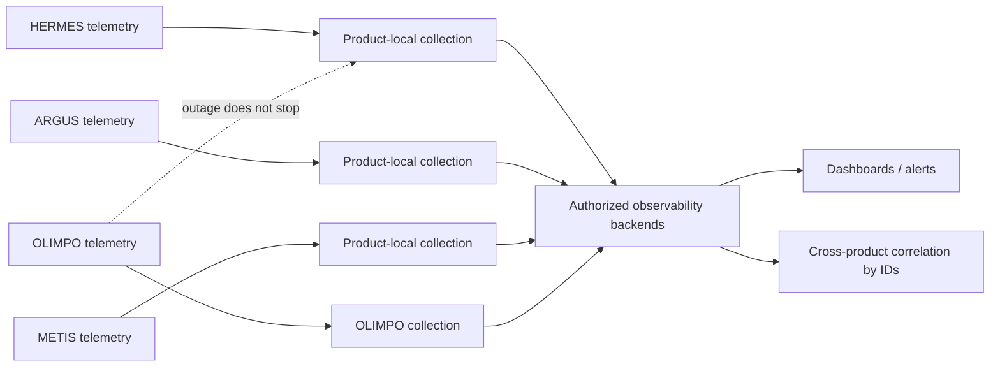

# Observability and Audit Model v1.0

## Observability standards

Every future component emits structured logs, metrics, distributed traces where useful, liveness/health and readiness signals, and stable request, correlation, causation, and event identifiers. Instrumentation should be OpenTelemetry-compatible and vendor-neutral at the application boundary.

Logs use timestamps, severity, service/version/environment, operation, result, latency, and relevant IDs. Metrics have bounded-cardinality labels. Traces sample intentionally and propagate context across authorized boundaries. Health checks distinguish process liveness, dependency readiness, and degraded optional capabilities; they reveal no sensitive configuration.

Telemetry excludes passwords, tokens, cookies, authorization headers, secret references that reveal provider paths, and unnecessary personal data. Redaction occurs before export. Access, retention, regional handling, and deletion follow classification and policy.

## Ecosystem health

The OLIMPO dashboard can summarize HERMES, ARGUS, METIS, integrations (for example `12/12 Healthy`), event pipeline, automations, notifications, identity connectivity, and recent significant events. Status includes evidence, source, last observation, and staleness. Unknown is not reported as healthy. Product-local telemetry remains operational if OLIMPO is down.

## Immutable-oriented audit

Audit records answer who/what/when/where, source, target, result, correlation ID, request ID, actor and service identity, policy/automation version, and appropriate redacted before/after metadata. Examples include a user changing the ARGUS-to-METIS automation and ARGUS-caused creation of `METIS-10482` linked to its originating event.

Audit is append-only through normal application interfaces, tamper-evident where feasible, access-controlled, exportable, time-synchronized, and governed by retention/legal policy. Corrections append a linked record. High-risk actions generate timely security alerts. Audit ingestion failure causes defined behavior: consequential administration fails closed or durably queues evidence; routine product domain work continues locally and later forwards its audit evidence.

Operational logs support diagnosis and may be sampled or rotated. Audit records establish accountability and must not be silently sampled, edited, or treated as general debug storage. Both avoid secret values.

## SLO and alert direction

Service-level objectives, recovery objectives, and alert thresholds are not fixed in this phase. They must be defined per capability, recognizing that control-plane availability and each product's essential domain availability are separate. Alerts should be actionable, deduplicated, severity-consistent, and linked to runbooks and correlated evidence.
