# OLIMPO Monorepo Migration Plan v1.0

Status: Planning only  
Execution requires explicit human approval

## Goals and invariants

Consolidate the OLIMPO Control Plane, HERMES, ARGUS, and METIS into one source repository while retaining independent products and history provenance.

> **Products remain operationally autonomous; OLIMPO provides shared control-plane capabilities, not mandatory data-plane dependency.**

> **Tenant isolation is a security boundary. Tenant data, identity, credentials, events, integrations, automation, operational state, and audit context must not cross tenant boundaries without explicit authorized platform-level behavior.**

> **Repository consolidation does not imply runtime consolidation.**

Repository consolidation does not consolidate databases, deployments, service identities, secrets, authorization, observability, recovery, releases, or runtime failure domains. No full-suite build or deployment is required for ordinary product operation.

## Recommended method

Subject to acceptance of [ADR 0009](../adr/0009-history-preserving-monorepo-migration-strategy.md), prepare each source in a disposable mirror/clone using `git filter-repo` to add the product path prefix. Import rewritten refs into a fresh OLIMPO clone and join histories with explicit merge commits. Produce old-to-new SHA maps and namespaced tag maps. Do not install missing tooling or execute any migration until the exact script and tool version are reviewed.

`git filter-repo` was not installed during the 2026-08-17 inspection. Installation instructions and integrity/version verification must be approved separately. Tool absence is not a reason to use archive/copy, subtree, or an unsafe ad hoc rewrite.

## Phases and gates

### Phase A — Inventory and architecture plan

Freeze a signed-off inventory of repository URLs, HEADs, statuses, refs, tags, object types, release evidence, structures, versions, workflows, and sizes. Accept ADR 0008; review Proposed ADR 0009. Resolve open decisions and confirm source repositories remain authoritative.

Gate: human approval of inventory, target layout, import refs, tag map, release policy, and exact migration strategy.

### Phase B — Isolated migration workspace and backups

Create `/home/rolando/projects/olimpo/migration-work/` with fresh mirrors or clones. Create and verify `git bundle --all` snapshots and checksums. Record tool versions and immutable source-ref manifests. Never work in authoritative source working directories.

Gate: successful test restoration and unchanged source HEAD/status evidence.

### Phase C — Prepare rewritten sources

Run the reviewed `git filter-repo` commands only in disposable preparation clones. Prefix paths, apply the approved tag namespace, retain required refs, and capture commit/tag maps. Do not push preparation clones.

Gate: commit counts/topology, metadata, tree transforms, refs, and maps validate against source bundles.

### Phase D — Import HERMES first

Fetch prepared HERMES refs into the fresh OLIMPO migration clone, create a deliberate unrelated-history merge, and validate `products/hermes/`. Verify `hermes-v26.08-02` against source tag object `5b531a…`, source commit `bcf0d8d…`, source release branch/main, prefixed release tree, version/changelog, CI paths, Go tests/builds, and provenance map.

Gate: conservative HERMES checklist and human review pass before another product is prepared for import.

### Phase E — Import ARGUS

Repeat the proven process for `products/argus/`. Preserve documentation binaries/assets and current scaffold structure. Validate file/tree equivalence, metadata, version, documentation links, and available baseline checks. Do not claim tenant-isolation implementation.

### Phase F — Import METIS

Repeat for `products/metis/`. Preserve main history and record backup refs in the source manifest; import backup heads only if approved. Validate the architecture baseline, invariant files, assets, review scripts, and lack of an established product version.

### Phase G — Establish shared monorepo structure

Classify OLIMPO ecosystem versus Control Plane documents, create product instruction hierarchy, introduce root ownership/impact metadata, and create only shared packages/schemas with approved owners and consumers. Adjust paths and links without altering product domain authority. Define independent task-runner entry points and path-aware CI plans; do not implement deployment or force uniform product internals.

### Phase H — Validate

Validate all source/import SHA maps, refs, tags, tag types, release trees, author/date/message samples, versions, changelogs, documentation, relative links, binaries, Git LFS requirements if discovered, independent builds/tests, path-aware workflow behavior, repository cleanliness, secret scanning, and absence of cross-product database/runtime coupling. Record exact results.

Gate: no unresolved history, HERMES release, security, tenant, autonomy, or build discrepancy.

### Phase I — Push migration branch

Only with explicit approval, push a new migration branch without force. Do not push source-repository refs or alter source remotes.

### Phase J — Human review and pull request

Only with explicit approval, open a PR containing provenance evidence, release/tag mapping, file and commit statistics, CI results, security/autonomy review, and rollback instructions. Product owners review their paths; cross-product reviewers review shared contracts.

### Phase K — Merge

Merge only after required reviews and checks. Do not combine this source merge with production deployment, data migration, or release publication.

### Phase L — Validation period

Keep old repositories active/read-only by convention and retain their releases. Compare routine builds, tags, source lookup, blame/provenance, CI, and product release procedures. Correct problems forward in the monorepo.

### Phase M — Later redirect/archive old repositories

After an approved validation period: add migration notices and links to each old README; verify releases, tags, bundles, and provenance remain accessible; stop new development there; then separately approve GitHub archival/read-only status. Never delete HermesDDNS, Argus, or METIS.

```mermaid
flowchart LR
  A[Active source repositories] --> B[Isolated mirrors and verified bundles]
  B --> C[History rewrite and provenance maps]
  C --> D[HERMES-first import and validation]
  D --> E[ARGUS and METIS import]
  E --> F[Migration branch and human PR]
  F --> G[Merge without deployment]
  G --> H[Validation period]
  H --> I[Later README redirect and optional archive]
```

## CI/CD and independent release model

Path filters provide an initial candidate set; a dependency graph expands it for changed shared packages/schemas. Each product workflow supports direct manual invocation and validates only that product plus its declared dependencies. Shared contracts run consumer-driven tests for all affected consumers. Full-repository checks are additional evidence, not the normal prerequisite for an isolated product build.

Product release workflows accept a product-prefixed tag, validate that product's `VERSION`/changelog, build only its artifacts, attach product-specific notes/checksums, and never deploy automatically without authorization. Deployment definitions remain per product. No workflow creates one required all-products image, database, or rollout.

## Multi-tenant alignment after migration

The migration preserves current behavior; it does not silently retrofit tenancy. Subsequent product-owned phases should:

1. Map each product's current customer/organization concepts to Platform/Tenant/Organization/Site without losing native authority.
2. Adopt tenant-aware shared schemas only after product ADR and data-migration review.
3. Add server-side tenant authorization and cross-tenant negative tests for data, search, caches, jobs, events, integrations, credentials, audit, and deep links.
4. Establish per-tenant identity/RBAC mapping and product-specific failure/recovery behavior.
5. Update the suite alignment matrix only with evidence.

HERMES, ARGUS, and METIS must not be described as tenant-isolated until those phases are implemented and reviewed.

## Human decisions before execution

- Accept or revise ADR 0009 and the exact reviewed migration script/tool version.
- Decide whether existing OLIMPO history is rewritten into `platform/olimpo/` or transitions at the migration commit.
- Approve the permanent historical/release branches to import.
- Approve reference-only versus mirrored historical GitHub Releases.
- Decide METIS versioning before its first release, not as a migration side effect.
- Approve CODEOWNERS/reviewer assignments, CI platform limits, shared-package owners, and package publication model.
- Define validation-period duration and old-repository archive criteria.
- Decide whether binary architecture assets need Git LFS after measurement; do not rewrite them casually.
