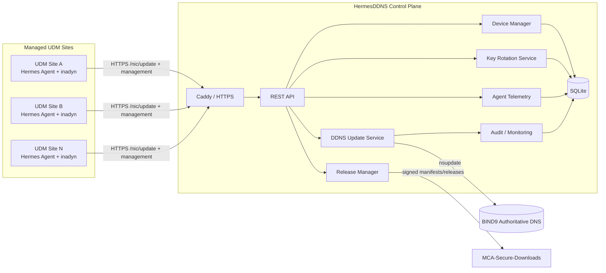
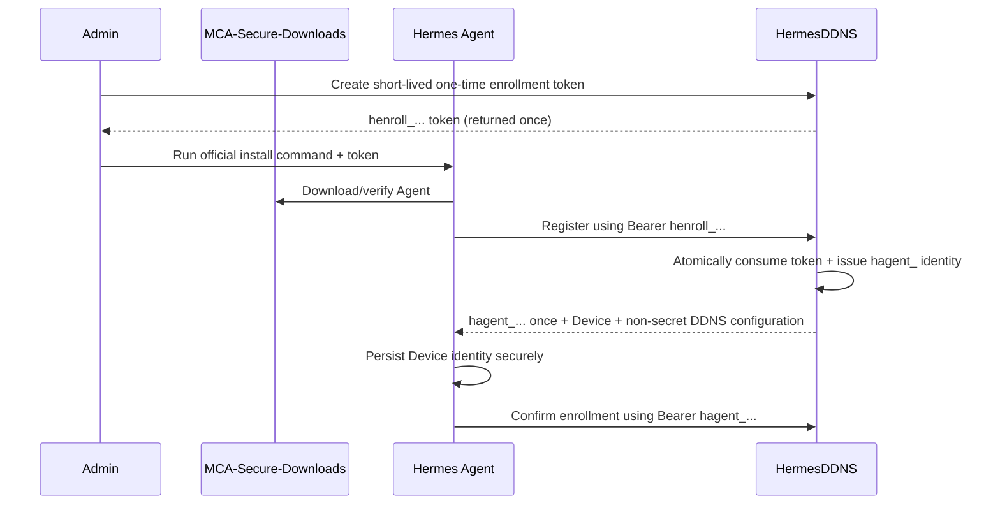
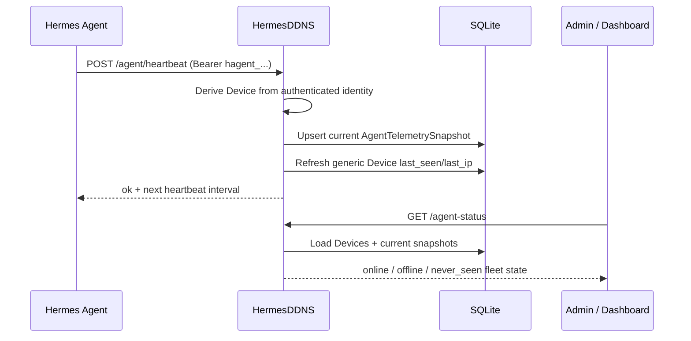
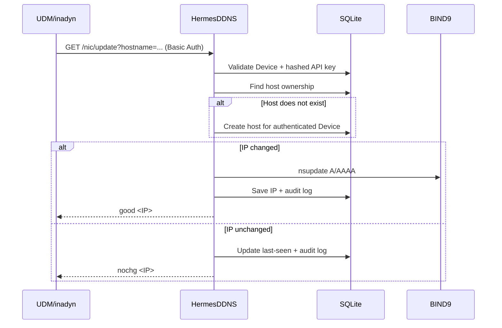
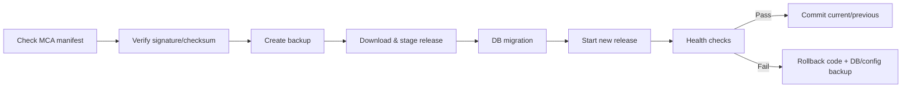

# HermesDDNS Architecture & Functional Specification v1.0

**Status:** Draft v1.0
**Date:** August 2026
**Product release family:** HermesDDNS 26.xx-xx

This specification is the design contract for HermesDDNS. The illustrated pages in `pages/` are conceptual storyboards and architecture views. Version labels visible inside the conceptual UI artwork are examples; production releases use the MCA convention `YY.MM-RR`, beginning with **26.08-01**.

## 1. Purpose and scope

HermesDDNS is a self-hosted Dynamic DNS control plane for centrally managing UniFi Dream Machine sites. It builds on the useful DNS-update mechanics of the upstream `docker-ddns-server` project while replacing its per-host plaintext credential model with device identities, hashed DDNS API keys, automatic host provisioning, centralized audit data, and a managed release lifecycle.

The target platform consists of:

- HermesDDNS Server.
- BIND9 authoritative DNS with `nsupdate` integration.
- Administrative REST API and Web UI.
- Hermes UDM Agent for enrollment, heartbeats, managed configuration, key rotation, and agent updates.
- MCA-Secure-Downloads as the authoritative software/release distribution service.

## 2. High-level architecture



## 3. Logical data model

```mermaid
erDiagram
  DOMAIN ||--o{ HOST : contains
  DEVICE ||--o{ HOST : owns
  DEVICE ||--o{ DDNS_CREDENTIAL : authenticates_with
  DEVICE ||--o{ DEVICE_IDENTITY_CREDENTIAL : agent_authenticates_with
  DEVICE ||--o{ AGENT_ENROLLMENT : bootstraps_with
  DEVICE ||--o| AGENT_TELEMETRY_SNAPSHOT : reports_current_state
  DEVICE ||--o{ UPDATE_LOG : generates
  HOST ||--o{ UPDATE_LOG : receives
  DDNS_CREDENTIAL ||--o{ UPDATE_LOG : used_by
  RELEASE_CHANNEL ||--o{ AGENT_RELEASE : publishes

  DOMAIN {
    uint id PK
    string name UK
    int default_ttl
    bool enabled
    bool wildcard
  }
  DEVICE {
    uint id PK
    string name UK
    string status
    string last_ip
    datetime last_seen_at
    string agent_version
  }
  DEVICE_IDENTITY_CREDENTIAL {
    uint id PK
    uint device_id FK
    string credential_id UK
    string secret_hash
    string status
    datetime activated_at
    datetime expires_at
    datetime revoked_at
    datetime last_used_at
    string last_used_ip
  }
  AGENT_ENROLLMENT {
    uint id PK
    uint device_id FK
    string token_id UK
    string secret_hash
    string status
    datetime expires_at
    datetime issued_at
    datetime completed_at
    datetime revoked_at
    string used_ip
    uint agent_credential_id FK
  }
  AGENT_TELEMETRY_SNAPSHOT {
    uint id PK
    uint device_id FK UK
    datetime last_heartbeat_at
    string last_ip
    string agent_version
    string system_hostname
    string platform
    string architecture
    string os_version
    string kernel_version
    string firmware_version
    string boot_id
    uint64 uptime_seconds
    int cpu_count
    float load_1
    float load_5
    float load_15
    uint64 memory_total_bytes
    uint64 memory_available_bytes
    uint64 disk_total_bytes
    uint64 disk_available_bytes
  }
  HOST {
    uint id PK
    uint domain_id FK
    uint device_id FK
    string hostname
    string ip_address
    string record_type
    int ttl
    datetime last_update
  }
  DDNS_CREDENTIAL {
    uint id PK
    uint device_id FK
    string key_id UK
    string secret_hash
    string status
    datetime grace_until
    datetime revoked_at
  }
  UPDATE_LOG {
    uint id PK
    uint device_id FK
    uint host_id FK
    uint credential_id FK
    string operation
    string status
    string response_code
    string sent_ip
    string caller_ip
  }
```

## 4. Core functional flows

### 4.1 Enrollment



### 4.2 Agent heartbeat and current telemetry

The Hermes Agent sends an authenticated heartbeat every 60 seconds by default. `AgentTelemetrySnapshot.last_heartbeat_at` is the authoritative Agent-presence signal; `Device.last_seen_at` remains a broader activity field that can also be refreshed by DDNS traffic. A Device is considered Agent-online while its last heartbeat is no more than 180 seconds old. Hermes stores one current telemetry snapshot per Device rather than an unbounded heartbeat history.



### 4.3 DDNS update



### 4.4 DDNS API-key rotation

```mermaid
sequenceDiagram
  participant Admin
  participant Hermes as HermesDDNS
  participant Agent as Hermes Agent
  participant DDNS as DDNS Endpoint
  Admin->>Hermes: Request DDNS credential rotation
  Hermes->>Hermes: Rotation = requested; old key remains active
  Agent->>Hermes: GET current rotation
  Agent->>Agent: Generate new hddns_ key locally
  Agent->>Hermes: Stage Key ID + SHA-256 hash only
  Hermes->>Hermes: Candidate = pending; rotation = staged
  Agent->>Agent: Prepare candidate in inadyn
  Agent->>Hermes: Start validation
  Hermes->>Hermes: Candidate = active; old key remains active
  Agent->>DDNS: Real /nic/update using candidate
  DDNS-->>Agent: good/nochg
  Hermes->>Hermes: Confirm candidate; old key = grace
  Hermes->>Hermes: Reconcile grace expiry; old key = revoked
  Note over Hermes,Agent: Candidate plaintext is generated and retained by the Agent, never by Hermes during rotation.
```

## 5. DDNS compatibility contract

HermesDDNS will accept:

- `/update`
- `/nic/update`
- `/v2/update`
- `/v3/update`

Primary responses:

- `good <IP>`
- `nochg <IP>`
- `badauth`
- `notfqdn`
- `badagent`
- `dnserr`
- `911` (reserved for temporary server failure compatibility)

## 6. Security model

1. Administrative authentication is independent from UDM/device authentication.
2. Device identity credentials are independent from DDNS API keys.
3. DDNS API keys use high-entropy random secrets and are never stored plaintext after issuance.
4. A Device may only create/update hostnames it owns.
5. Managed zones are restricted by server configuration and domain policy.
6. HTTPS is required for Internet-facing update and management traffic.
7. Reverse-proxy headers are ignored unless explicitly trusted.
8. Key rotation uses an overlap/grace window to avoid self-lockout.
9. DNS dynamic updates move toward TSIG-authenticated `nsupdate` rather than unrestricted update authority.
10. Critical actions produce immutable/auditable event records.

## 7. Server deployment and release lifecycle

```text
/opt/hermesddns/
├── releases/
│   ├── 26.08-01/
│   └── ...
├── current  -> releases/<active>
├── previous -> releases/<prior>
├── data/
├── config/
└── backups/
```

Target update flow:



The initial codebase lays the version/build foundation. Full `hermesctl update`, backup/restore, channel pinning and automated rollback are subsequent milestones.

## 8. UI storyboards

The conceptual pages are maintained in `pages/`:

- Page 06 — Login, Dashboard, System Health.
- Page 07 — Devices, Device Detail, API-Key Rotation, Enrollment.
- Page 08 — Domains, Hosts, Add/Edit Host, Host History.
- Page 09 — Audit Logs, Releases/Updates, Settings, Backup/Health.

The storyboards are the UI direction, not a pixel-perfect implementation contract. Backend/API security and data ownership rules take precedence over visual mockup examples.

## 9. Versioning

Project releases follow the MCA release convention:

```text
26.08-01
YY.MM-RR
```

Server and Agent versions are independent:

```text
HermesDDNS Server  26.08-01
HermesDDNS Agent   26.08-01
```

The document itself remains **Architecture & Functional Specification v1.0** until the architecture contract changes materially.
