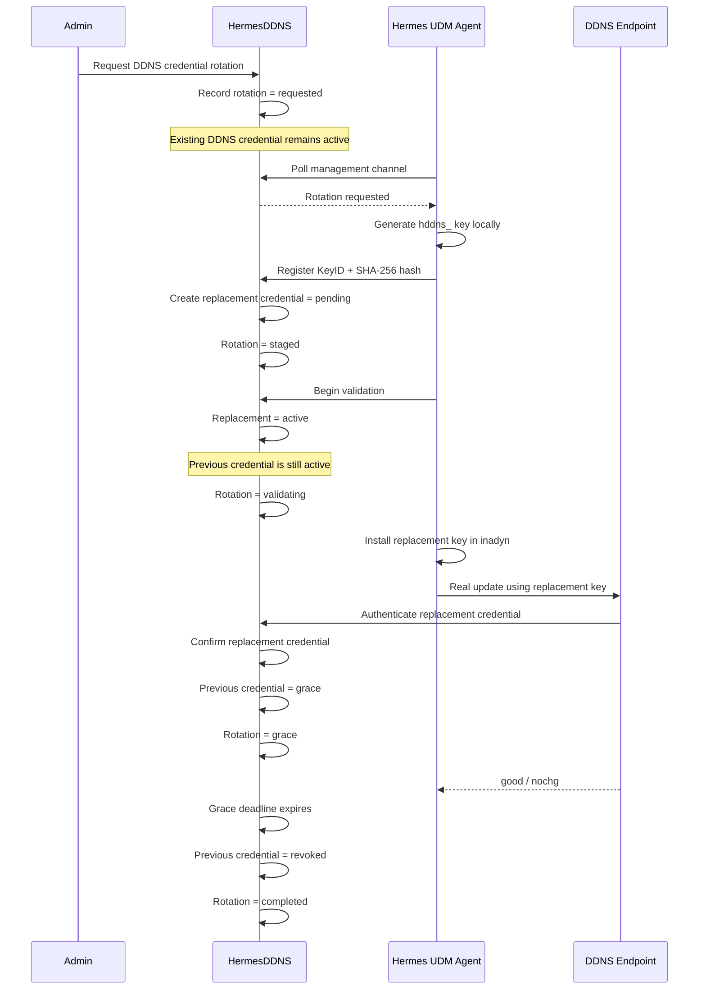

# HermesDDNS 26.08-02 — DDNS Credential Rotation Lifecycle

## Purpose

HermesDDNS 26.08-02 introduces the server-side lifecycle required for safe, remotely managed DDNS credential rotation. The design keeps the permanent Device Identity Credential independent from the DDNS credential used by `inadyn`.

A key security requirement is that Hermes never needs to persist a DDNS secret in plaintext. For automated rotations initiated from the future Web/Admin interface, the server records a rotation request and the authenticated Hermes UDM Agent generates the replacement DDNS secret locally. The Agent registers only the replacement key ID and SHA-256 hash with Hermes.

This changes the earlier conceptual flow in which the server generated a secret and attempted to push it later. Because Hermes stores only hashes, generating a secret before an Agent is ready would make reliable re-delivery impossible without adding plaintext or reversible secret storage. Agent-side generation avoids that problem while preserving centralized administrative control over when a rotation occurs.

## Credential separation

```text
Device
├── DeviceIdentityCredential
│   └── Agent <-> Hermes management authentication
│
└── DDNSCredential
    └── inadyn -> /nic/update
```

The Device Identity Credential is not rotated as part of the DDNS credential lifecycle.

## Rotation states

```text
requested
    |
    v
staged
    |
    v
validating
    |
    | replacement DDNS key authenticates successfully
    v
grace
    |
    | grace deadline expires
    v
completed

Any non-completed rotation may be rolled back when its state permits it.
```

### requested

An administrator requests a rotation. Hermes records the current active DDNS credential as the credential that will eventually be replaced. No new DDNS secret exists yet and the existing credential remains fully active.

### staged

The authenticated Agent generates a new `hddns_...` key locally and registers only its key ID and SHA-256 hash. Hermes creates the replacement `DDNSCredential` with status `pending`.

### validating

Hermes changes the replacement credential from `pending` to `active`, while deliberately leaving the previous credential `active` as well. This overlap is intentional: the old key does not enter grace until Hermes has proof that the new key actually works.

The Agent installs the replacement key in the local DDNS client and performs a real DDNS update.

### grace

When the replacement credential successfully authenticates to the DDNS endpoint, Hermes records its confirmation and changes the previous credential from `active` to `grace`. The configured grace deadline begins at that moment.

This ordering prevents a UDM from losing DDNS service merely because a rotation was requested or a replacement credential was staged.

### completed

After the grace deadline passes, Hermes revokes the previous credential and marks the rotation completed. The replacement credential remains active.

## Sequence



## Rollback behavior

- From `requested`: close the request; the existing credential is untouched.
- From `staged`: revoke the pending replacement; the existing credential remains active.
- From `validating`: revoke the replacement; the previous credential remains active.
- From `grace`: restore the previous credential to `active`, remove its grace deadline, revoke the replacement, and record the rotation as rolled back.
- A completed rotation is not automatically rolled back by this lifecycle primitive.

## Security properties

1. The admin initiates rotations centrally, but no plaintext DDNS secret needs to be stored on the server for later delivery.
2. Replacement credentials are not trusted merely because they were registered by an Agent.
3. The previous credential remains fully active until the replacement has successfully authenticated.
4. A bounded grace period provides rollback time after validation.
5. Only one open rotation is allowed for a Device at a time.
6. Candidate key IDs and hashes are validated before persistence.
7. The final integration will authenticate Agent lifecycle calls with `DeviceIdentityCredential`, independently of the DDNS credential.

## 26.08-02 implementation boundary

This milestone implements the lifecycle model and core service primitives. HTTP endpoints for Agent enrollment/polling and Web/Admin controls are wired in subsequent blocks after the lifecycle behavior is fully tested.
